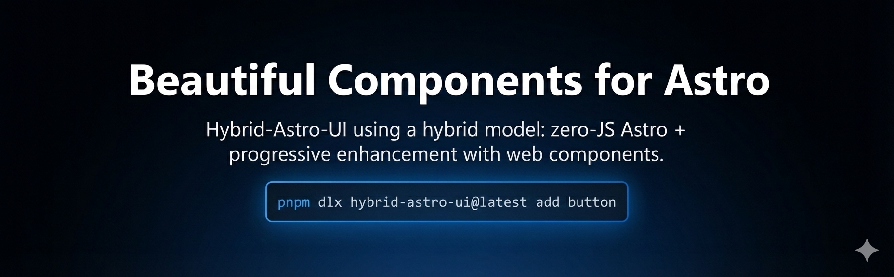

# 🌟 Hybrid Astro UI

**UI elements for Astro using a hybrid model: zero-JS Astro + progressive enhancement with web components.**




[](https://www.npmjs.com/package/hybrid-astro-ui)
[](LICENSE)

---

## ✅ What this is

Hybrid Astro UI is a **CLI code generator**, not a runtime UI library.

When you add a component, the CLI **downloads the component source code** from this repository and writes it into your Astro project under:

- `src/components/hybrid-astro-ui/<component>/...`

From that point on, you can **edit everything** (markup, styles, logic) with **full control**—no wrappers, no locked abstractions.

## ❌ What this is not

- Not a “component library” you import from `node_modules`
- Not a black box: the generated components live in your repo
- Not an auto-updating system: you choose when/how to update your copied code

---

## ⚡ Quick start

Run in the root of your Astro project:

```bash
npx hybrid-astro-ui init
npx hybrid-astro-ui add button card
```

`init` helps configure your project (TypeScript paths + shared utilities + global styles). `add` copies component files into your project.

## ✨ Why Hybrid Astro UI?

Hybrid Astro UI provides a carefully crafted collection of high-quality components designed specifically for Astro.
Our hybrid approach combines **zero-JavaScript Astro components** for maximum performance and **progressively enhanced Web Components** only where interactivity is essential.

Perfect for teams and developers who value **design consistency, accessibility, and performance**—without compromising functionality.

---

## 📚 Documentation

Explore the full documentation, examples, and component library:
👉 **[https://hybrid-astro-ui.com](https://hybrid-astro-ui.com)**

---

## 🤝 Contributing

We welcome contributions! Whether it’s bug reports, feature requests, or pull requests—your input helps make **Hybrid Astro UI** better for everyone.

Please read the contribution guide: **[.github/CONTRIBUTING.md](.github/CONTRIBUTING.md)**

---

## 📄 License

MIT License — feel free to use, modify, and distribute responsibly.

---

<div align="center">
  <p>Built with ❤️ for the Astro community</p>
</div>


